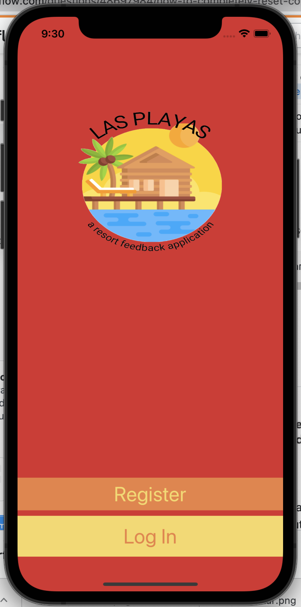
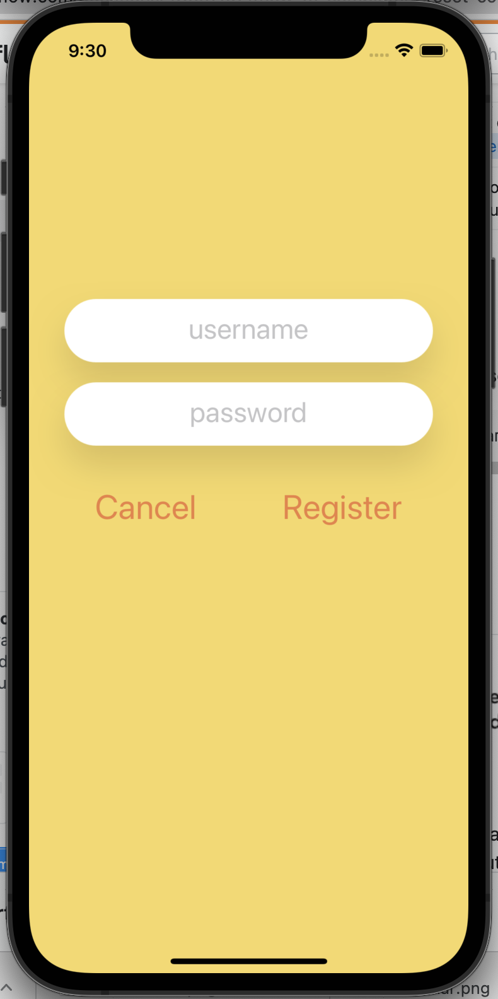
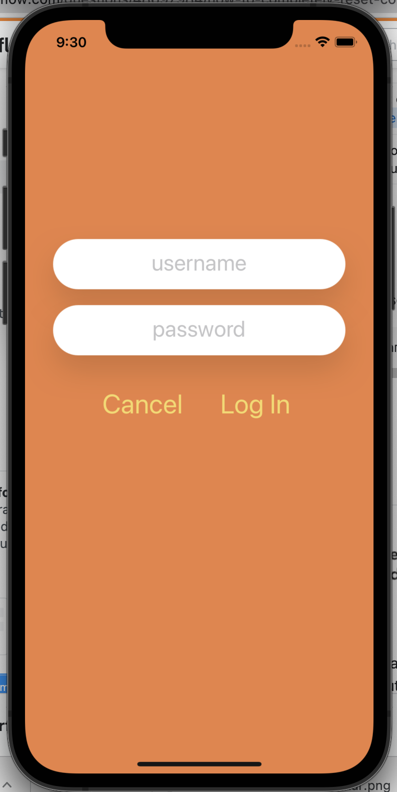
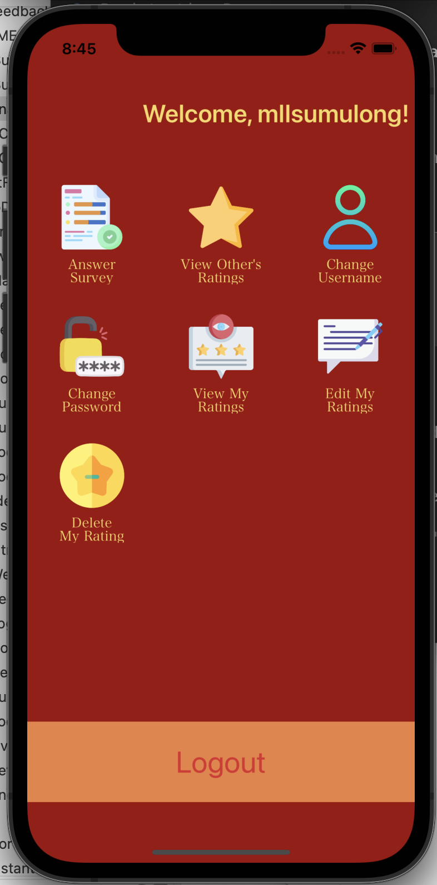
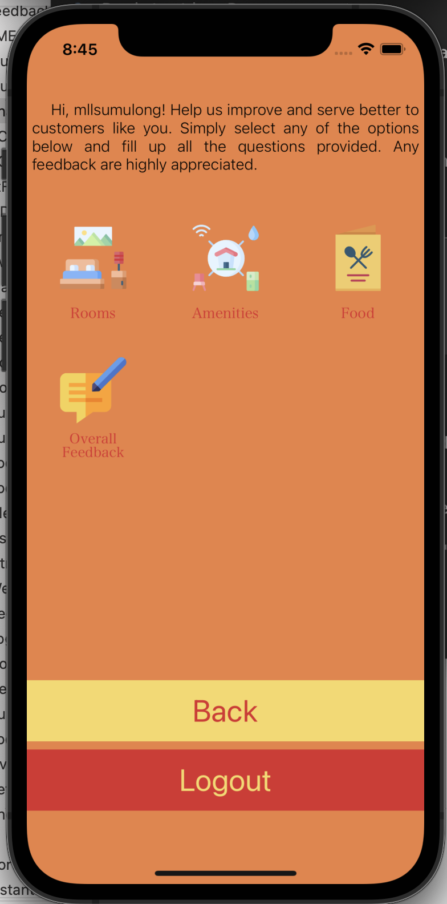
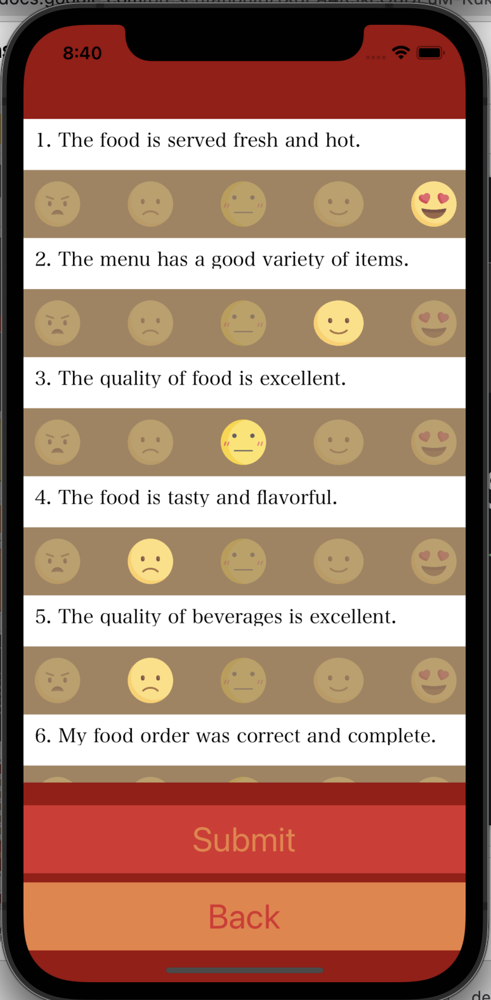
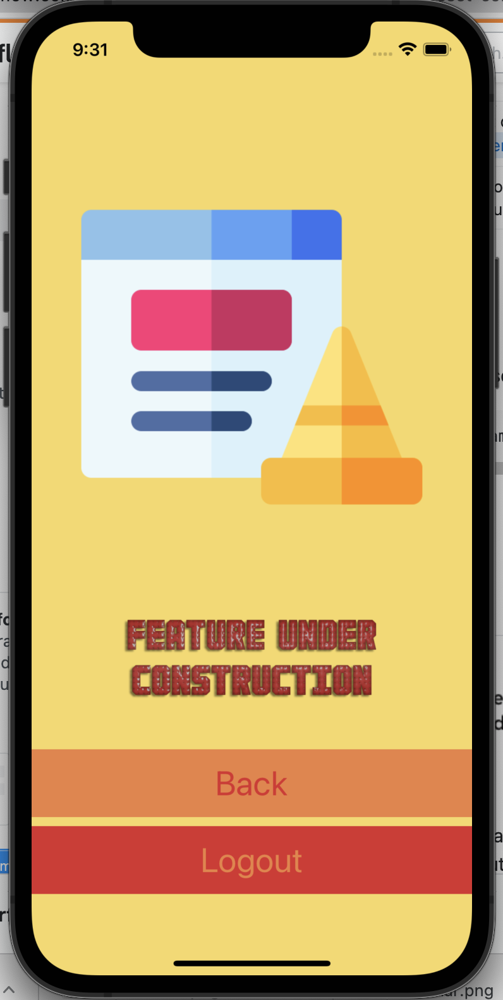

#  ResortFeedBack-IOS

An application built to test our knowledge with the modules learned during the first few weeks at Revature. It includes:

    - Swift Data and Collection Types
    - Swift Control Flow
    - View Controllers
    - TableView and CollectionView Controllers via View Controllers
    - CoreData

## Screenshots

1. Welcome Page

2. Registration Page

3. Log In Page

4. Home Page

5. Services Page

6. Food Survey Page

7. Under Construction Page - for future features

## Note
This is a group project under the supervision of Ms. Asha Rani

